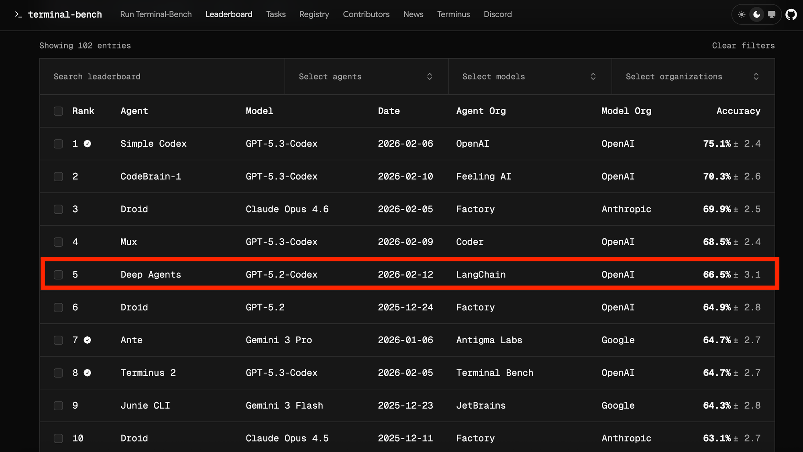

# Improving Deep Agents with harness engineering

8 min read · Feb 17, 2026

TLDR: Our coding agent went from Top 30 to Top 5 on [Terminal Bench 2.0](https://www.tbench.ai/leaderboard/terminal-bench/2.0). We only changed the harness. Here’s our approach to harness engineering (teaser: self-verification & tracing help a lot).

## The Goal of Harness Engineering

The goal of a harness is to mold the inherently spiky intelligence of a model for tasks we care about. **Harness Engineering** is about systems—you’re building tooling around the model to optimize goals like task performance, token efficiency, latency, etc. Design decisions include the system prompt, tool choice, and execution flow.

But how should you change the harness to improve your agent?

At LangChain, we use [Traces](https://docs.langchain.com/langsmith/observability-quickstart) to understand agent failure modes at scale. Models today are largely black-boxes; their inner mechanisms are hard to interpret. But we can see their inputs and outputs in text space, which we then use in our improvement loops.

We used a simple recipe to iteratively improve [deepagents-cli](https://github.com/langchain-ai/deepagents/tree/main/libs/cli) (our coding agent) **13.7 points** from **52.8** to **66.5** on Terminal Bench 2.0. We only tweaked the harness and kept the model fixed, **gpt-5.2-codex**.

## Experiment Setup & The Knobs on a Harness

We used [Terminal Bench 2.0](https://www.tbench.ai/), a benchmark to evaluate agentic coding. It has 89 tasks across domains like machine learning, debugging, and biology. We use [Harbor](https://harborframework.com/) to orchestrate the runs. It spins up sandboxes ([Daytona](https://www.daytona.io/)), interacts with our agent loop, and runs verification + scoring.

Every agent action is stored in [LangSmith](https://smith.langchain.com/). It also includes metrics like latency, token counts, and costs.

### The Knobs we can Turn

An agent harness has a lot of knobs: system prompts, tools, hooks/middleware, skills, sub-agent delegation, memory systems, and more. We deliberately compress the optimization space and focus on three: **System Prompt**, **Tools**, and **[Middleware](https://docs.langchain.com/oss/python/langchain/middleware/overview#the-agent-loop)** (our term for hooks around model and tool calls).

We start with a default prompt and standard tools + middleware. This scores **52.8%** with GPT-5.2-Codex—a solid score, just outside the Top 30 of the leaderboard at the time, but room to grow.

### The Trace Analyzer Skill

We wanted trace analysis to be repeatable, so we made it into an **Agent Skill**. This serves as our recipe to **analyze errors across runs and make improvements to the harness**. The flow is:

1. Fetch experiment traces from LangSmith  
2. Spawn parallel error analysis agents → main agent synthesizes findings + suggestions  
3. Aggregate feedback and make targeted changes to the harness.

This works similarly to [boosting](https://en.wikipedia.org/wiki/Boosting_(machine_learning))—focusing on mistakes from previous runs. A human can be helpful in Step 3 (though not required) to verify and discuss proposed changes. Changes that overfit to a task are bad for generalization and can lead to regressions in other tasks.

Automated trace analysis saves hours of time and made it easy to quickly try experiments. We’ll be publishing this skill soon; we’re currently testing it for prompt optimization generally.

## What Actually Improved Agent Performance

Automated trace analysis allowed us to [debug where agents were going wrong](https://www.langchain.com/conceptual-guides/agent-observability-powers-agent-evaluation). Issues included reasoning errors, not following task instructions, missing testing and verification, running out of time, etc. We go into these improvements in more detail in the sections below.

### Build & Self-Verify

Today’s models are exceptional self-improvement machines.

**Self-verification** allows agents to self-improve via feedback **within a run**. However, they don’t have a natural tendency to enter this **build–verify loop.**

The most common failure pattern was that the agent wrote a solution, re-read its own code, confirmed it looks OK, and stopped. **Testing** is a key part of autonomous agentic coding—it helps test overall correctness and gives agents signal to hill-climb against.

We added guidance to the system prompt:

1. **Planning & Discovery:** Read the task, scan the codebase, and build an initial plan based on the task specification and **how to verify** the solution.  
2. **Build:** Implement the plan with verification in mind. Build tests if they don’t exist; cover happy paths and edge cases.  
3. **Verify:** Run tests, read the full output, compare against what was asked (**not** against your own code).  
4. **Fix:** Analyze errors, revisit the original spec, and fix issues.

We really focus on testing because it powers every iteration. Alongside prompting, **deterministic context injection** helps agents verify their work. We use a `PreCompletionChecklistMiddleware` that intercepts the agent before it exits and reminds it to run a verification pass against the task spec—similar to a [Ralph Wiggum Loop](https://ghuntley.com/loop/) where a hook forces the agent to continue executing on exit; we use this for **verification**.

### Giving Agents Context about their Environment

Part of harness engineering is **building a good delivery mechanism for context engineering.** Terminal Bench tasks come with directory structures, built-in tooling, and strict timeouts.

1. **Directory Context & Tooling:** A `LocalContextMiddleware` runs on agent start to map the `cwd` and other parent/child directories. We run `bash` commands to find tools like Python installations. Context discovery and search are error-prone, so injecting context reduces this error surface and helps **onboard the agent into its environment.**  
2. **Teaching Agents to Write Testable Code:** Agents don’t know by default how their code must be testable. We add prompting that work will be measured against programmatic tests, similar to committing code. Task specs that mention file paths should be followed exactly so solutions work in automated scoring. Prompting that stresses edge cases helps avoid only checking “happy path” cases. Forcing models to conform to testing standards helps avoid “slop buildup” over time.  
3. **Time Budgeting:** We inject time budget warnings to nudge the agent to finish work and shift to verification. Agents are famously bad at time estimation; real-world coding often has no strict limits, but without constraint awareness they won’t respect time bounds in benchmark settings.

**The purpose of the harness engineer:** prepare and deliver context so agents can autonomously complete work.

### Encouraging Agents to Step Back & Reconsider Plans

Agents can become myopic once a plan is chosen—“doom loops” with small variations on a broken approach (10+ times in some traces).

We use a `LoopDetectionMiddleware` that tracks per-file edit counts via tool call hooks. It adds context like “…consider reconsidering your approach” after **N** edits to the same file. This can help agents recover from doom loops, though the model may continue if it believes it’s correct. **Important note:** this engineers around today’s perceived model issues; as models improve, these guardrails will likely be unnecessary—but today they help agents execute correctly and autonomously.

### Choosing How Much Compute to Spend on Reasoning

Reasoning models can run autonomously for hours, so we have to decide how much compute to spend per subtask. Terminal Bench timeout limits create a tradeoff: more reasoning helps evaluate each step but can burn over **2×** more tokens/time. `gpt-5.2-codex` has four reasoning modes: `low`, `medium`, `high`, and `xhigh`.

We found reasoning helps with **planning** (some tasks are very difficult; a good plan speeds time-to-solution) and **later-stage verification** (more reasoning catches mistakes before submit). As a heuristic we use **xhigh – high – xhigh** “**reasoning sandwich**” as a baseline—**spending more reasoning compute on planning and verification**.

Running only at `xhigh` scored poorly at **53.9%** due to agent timeouts compared to **63.6%** at `high`. Trial runs across reasoning budget splits weren’t hugely different, so we stuck with our approach, which pushed the score to **66.5%**.

The natural direction for models is **adaptive reasoning**, as with [Claude](https://platform.claude.com/docs/en/build-with-claude/adaptive-thinking) and [Gemini](https://ai.google.dev/gemini-api/docs/thinking). In a **multi-model harness**, balancing budgets could mean a large model for planning and [handing off](https://docs.langchain.com/oss/python/langchain/multi-agent/handoffs) to a smaller model for implementation.

## Practical Takeaways for Building Agent Harnesses

1. **Context engineering on behalf of agents** — especially in unseen environments: directory structure, tools, practices, problem-solving strategies.  
2. **Help agents self-verify** — models favor the first plausible solution; tests and refinement matter, especially without humans in the loop.  
3. **Tracing as a feedback signal** — debug **tooling and reasoning together** (wrong paths often mean missing tools or instructions).  
4. **Detect and fix bad patterns for today’s models** — guardrails may dissolve as models improve, but they help now.  
5. **Tailor harnesses to models** — [Codex](https://developers.openai.com/cookbook/examples/gpt-5/codex_prompting_guide/) vs [Claude](https://platform.claude.com/docs/en/build-with-claude/prompt-engineering/claude-prompting-best-practices) prompting guides differ; Claude Opus 4.6 scored **59.6%** with an earlier harness without the same improvement loop—principles generalize, but **per-model iteration** matters.

There’s more open research in harness design: multi-model systems (Codex, Gemini, Claude together), memory primitives for continual learning, measuring harness changes across models. For the outer loop we’re looking at methods like [RLMs](https://alexzhang13.github.io/blog/2025/rlm/) to mine traces more efficiently.

We created [a dataset of our traces](https://smith.langchain.com/public/29393299-8f31-48bb-a949-5a1f5968a744/d?tab=2) to share with the community. **Deep Agents** is open source: [Python](https://github.com/langchain-ai/deepagents), [JavaScript](https://github.com/langchain-ai/deepagentsjs).

**To more hill climbing and open research.**

---

> 离线归档：正文由 [LangChain Blog](https://blog.langchain.com/improving-deep-agents-with-harness-engineering/) 整理；外链已去掉部分 `?ref=` 跟踪参数。配图来自 Ghost `storage.ghost.io`，已保存至 `assets/`。页脚订阅与站点 chrome 已省略。
