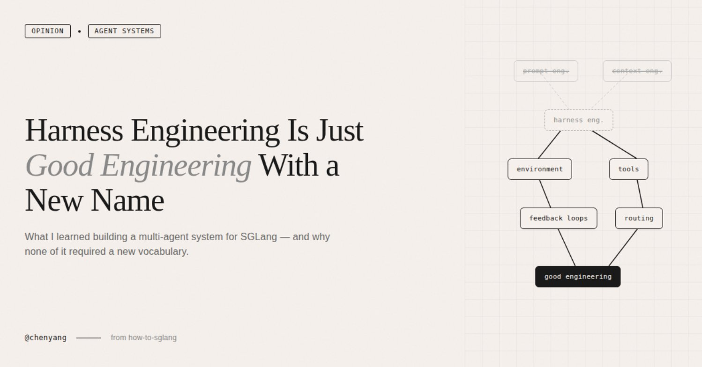

# X post by Chayenne Zhao (@GenAI_is_real)

**Published:** 2026-03-24 (10:20, per X UI)

---

Today I read a lengthy piece on Harness Engineering — tens of thousands of words, almost certainly AI-written. My first reaction wasn't "wow, what a powerful concept." It was "do these people have any ideas beyond coining new terms for old ones?"

I've always been annoyed by this pattern in the AI world — the constant reinvention of existing concepts. From prompt engineering to context engineering, now to harness engineering. Every few months someone coins a new term, writes a 10,000-word essay, sprinkles in a few big-company case studies, and the whole community starts buzzing. But if you actually look at the content, it's the same thing every time:

Design the environment your model runs in — what information it receives, what tools it can use, how errors get intercepted, how memory is managed across sessions. This has existed since the day ChatGPT launched. It doesn't become a new discipline just because someone — for whatever reason — decided to give it a new name.

That said, complaints aside, the research and case studies cited in the article do have value — especially since they overlap heavily with what I've been building with how-to-sglang. So let me use this as an opportunity to talk about the mistakes I've actually made.

Some background first. The most common requests in the SGLang community are How-to Questions — how to deploy DeepSeek-V3 on 8 GPUs, what to do when the gateway can't reach the worker address, whether the gap between GLM-5 INT4 and official FP8 is significant. These questions span an extremely wide technical surface, and as the community grows faster and faster, we increasingly can't keep up with replies. So I started building a multi-agent system to answer them automatically.

The first idea was, of course, the most naive one — build a single omniscient Agent, stuff all of SGLang's docs, code, and cookbooks into it, and let it answer everything.

That didn't work.

You don't need harness engineering theory to explain why — the context window isn't RAM. The more you stuff into it, the more the model's attention scatters and the worse the answers get. An Agent trying to simultaneously understand quantization, PD disaggregation, diffusion serving, and hardware compatibility ends up understanding none of them deeply.

The design we eventually landed on is a multi-layered sub-domain expert architecture. SGLang's documentation already has natural functional boundaries — advanced features, platforms, supported models — with cookbooks organized by model. We turned each sub-domain into an independent expert agent, with an Expert Debating Manager responsible for receiving questions, decomposing them into sub-questions, consulting the Expert Routing Table to activate the right agents, solving in parallel, then synthesizing answers.

Looking back, this design maps almost perfectly onto the patterns the harness engineering community advocates. But when I was building it, I had no idea these patterns had names. And I didn't need to.

1. **Progressive disclosure** — we didn't dump all documentation into any single agent. Each domain expert loads only its own domain knowledge, and the Manager decides who to activate based on the question type. My gut feeling is that this design yielded far more improvement than swapping in a stronger model ever did. You don't need to know this is called "progressive disclosure" to make this decision. You just need to have tried the "stuff everything in" approach once and watched it fail.

2. **Repository as source of truth** — the entire workflow lives in the how-to-sglang repo. All expert agents draw their knowledge from markdown files inside the repo, with no dependency on external documents or verbal agreements. Early on, we had the urge to write one massive sglang-maintain.md covering everything. We quickly learned that doesn't work. OpenAI's Codex team made the same mistake — they tried a single oversized AGENTS.md and watched it rot in predictable ways. You don't need to have read their blog to step on this landmine yourself. It's the classic software engineering problem of "monolithic docs always go stale," except in an agent context the consequences are worse — stale documentation doesn't just go unread, it actively misleads the agent.

3. **Structured routing** — the Expert Routing Table explicitly maps question types to agents. A question about GLM-5 INT4 activates both the Cookbook Domain Expert and the Quantization Domain Expert simultaneously. The Manager doesn't guess; it follows a structured index. The harness engineering crowd calls this "mechanized constraints." I call it normal engineering.

I'm not saying the ideas behind harness engineering are bad. The cited research is solid, the ACI concept from SWE-agent is genuinely worth knowing, and Anthropic's dual-agent architecture (initializer agent + coding agent) is valuable reference material for anyone doing long-horizon tasks. What I find tiresome is the constant coining of new terms — packaging established engineering common sense as a new discipline, then manufacturing anxiety around "you're behind if you don't know this word."

Prompt engineering, context engineering, harness engineering — they're different facets of the same thing. Next month someone will probably coin scaffold engineering or orchestration engineering, write another lengthy essay citing the same SWE-agent paper, and the community will start another cycle of amplification.

What I actually learned from how-to-sglang can be stated without any new vocabulary:

Information fed to agents should be minimal and precise, not maximal. Complex systems should be split into specialized sub-modules, not built as omniscient agents. All knowledge must live in the repo — verbal agreements don't exist. Routing and constraints must be structural, not left to the agent's judgment. Feedback loops should be as tight as possible — we currently use a logging system to record the full reasoning chain of every query, and we've started using Codex for LLM-as-a-judge verification, but we're still far from ideal.

None of this is new. In traditional software engineering, these are called separation of concerns, single responsibility principle, docs-as-code, and shift-left constraints. We're just applying them to LLM work environments now, and some people feel that warrants a new name.

I don't know how many more new terms this field will produce. But I do know that, at least today, we've never achieved a qualitative leap on how-to-sglang by swapping in a stronger model. What actually drove breakthroughs was always improvements at the environment level — more precise knowledge partitioning, better routing logic, tighter feedback loops. Whether you call it harness engineering, context engineering, or nothing at all, it's just good engineering practice. Nothing more, nothing less.

There is one question I genuinely haven't figured out: if model capabilities keep scaling exponentially, will there come a day when models are strong enough to build their own environments? I had this exact confusion when observing OpenClaw — it went from 400K lines to a million in a single month, driven entirely by AI itself. Who built that project's environment? A human, or the AI? And if it was the AI, how many of the design principles we're discussing today will be completely irrelevant in two years?

I don't know. But at least today, across every instance of real practice I can observe, this is still human work — and the most valuable kind.

---

> 离线归档：正文来自已登录浏览器下 Chrome DevTools 无障碍快照（`take_snapshot`），与 [原帖](https://x.com/GenAI_is_real/status/2036266930290696599) 对照勘误；互动数据以快照为准可能略有滞后。
