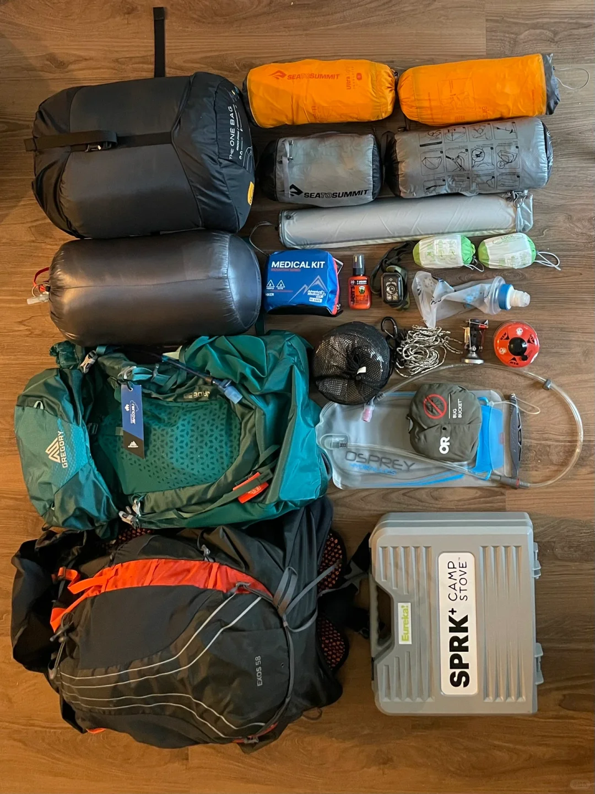
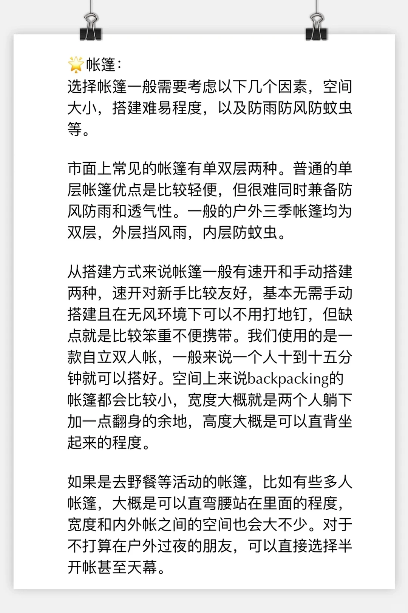
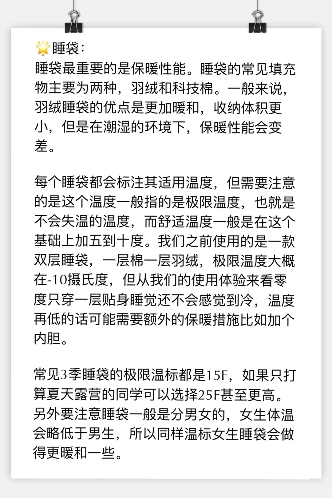
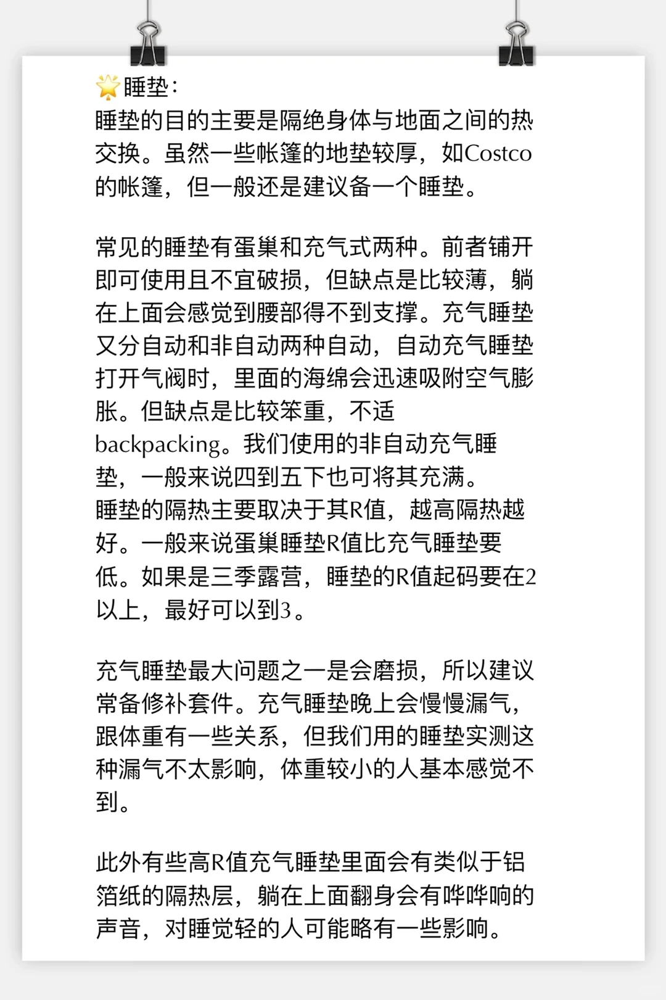

# 给这个夏天想尝试露营的新手的保姆级指南

> 抓取说明：正文与资源路径对应关系见同目录 `detail.json` 中的 `local_assets`。

## 元数据

- **笔记 ID**: `64865efd0000000013033348`
- **作者**: jiajia404
- **类型**: normal
- **原文链接**: http://xhslink.com/o/1pq92MoCKK1 / https://www.xiaohongshu.com/discovery/item/64865efd0000000013033348?app_platform=ios&app_version=9.24&share_from_user_hidden=true&xsec_source=app_share&type=normal&xsec_token=CBLXGPPopVDyvXC3L9NKfknY-FhPgwq4SJb6JkCe4ohsg=&author_share=1&xhsshare=CopyLink&shareRedId=N0dINzZISTo6TEZFSkozS0pJTzw1ODlM&apptime=1775630941&share_id=6a5823ddad1049449f992d8c2c6104ff

## 正文

写了一个装备清单和营地选取指南。有其他的问题可以在评论区问我。
	
‼️必备装备：
🌟睡眠系统：帐篷，睡袋，睡垫三大件，详细的写在截图里了。选对了这三件比在家里还舒服。
🌟炉具：一般就是一个小灶台，需要自己插入气罐使用。美国这边普通超市就会出售这种气罐，所以没有必要在户外店买，价格差了很多。唯一需要注意的就是要选对气罐规格。我们用的8oz气罐燃烧时间大概在一个小时到一个半小时，足够两个人吃一顿晚饭，外加一顿简单的早饭。
🌟照明：露营主要照明装备就是头灯和营地灯。头灯一般选择300流明以上就足够了。营地灯一般是挂在帐篷里面的，但要注意有些帐篷只能选择与其配适的营地灯。
	
其他装备一般来说不是必须，以下物品仅供参考
✨点火器/引火物（主要用于点篝火）：超市有卖大火柴，兼顾了点火和引火。
✨充气枕头（可以睡的舒服一些，我们一开始没有枕头也问题不大）
✨厨具：可以带家里的锅，可以配烤炉。注意如果是气罐炉上架烤盘的话，烤盘不要盖住气罐上方，不然气罐受热可能会爆炸。
✨驱蚊药
✨滤水设备
✨露营桌椅：我们就用营地的。
	
🌟营地选取
美国这边国家公园里的营地一般就是一块空地外加一个车位。有的营地会有平台，一般来说一个平台足够放两个双人帐。我们选取营地一般考察以下几件事情
1.有无洗手间，有些营地只有旱厕，比较不方便。而且没有洗手间往往意味着取水不便，通常我们不会定这种营地。
2.蚊虫，在水边的营地往往蚊虫叮咬比较严重，需要在帐篷上也喷上防蚊喷剂。我们定的时候一般会选择尽量远离河水的区域。
3.噪声，噪声主要来源就是马路。我们之外住过一个营地离马路只有三四十米，晚上睡觉很吵。
	
我们主要都在国家公园/森林里面的营地，这样可以增加很多游玩的时间。很多私人营地据说条件很好，洗手间里一般也都能洗热水澡，只是价格比较昂贵。
	
现在美国热门国家公园的营地都非常火爆，往往需要提前半年预约，建议同学们都提前计划，如果实在定不到可以等邻近时候看有没有人退。
	
#和大自然亲密接触[话题]# #笔记灵感[话题]# #露营[话题]# #户外露营[话题]# #露营装备[话题]# #小红书露营季[话题]# #露营装备大赏[话题]# #露营装备推荐[话题]# #美国露营[话题]# #美国旅行[话题]# #美国国家公园[话题]# #波士顿周边露营[话题]# #纽约周边露营[话题]#

## 图片（本地）

## 评论（最多 20 条）

1. **jiajia404**（赞 2）: 如果大家有兴趣的话，之后会发一些自己在用的装备测评。

2. **大肉包小褶皱**（赞 0）: 请问怎么判断是旱厕还是冲水马桶呀？我看网站上好像就是写restroom
   - 1. jiajia404: 要看仔细看营地facility介绍：有的会写vault toilet only

3. **北极铄星✨**（赞 0）: 两天一夜轻量化露营，打算买三峰出的蓝山2pro和黑冰e700，但是睡垫一直很纠结...有推荐吗？另外求推荐一个炉子，网上看到好多说soto蜘蛛炉，但是看起来很不安全的样子[笑哭R]
   - 1. jiajia404: 睡垫我们用的seatosummit充气睡垫；炉子用的MSR

4. **骑士小比熊**（赞 0）: camping的营地一般会有电吗？
   - 1. 鱼丸蒸蛋拌饭: 一般都没有

5. **信马由缰**（赞 0）: 气罐多少钱？

6. **randomWalks_**（赞 0）: 需要防熊吗
