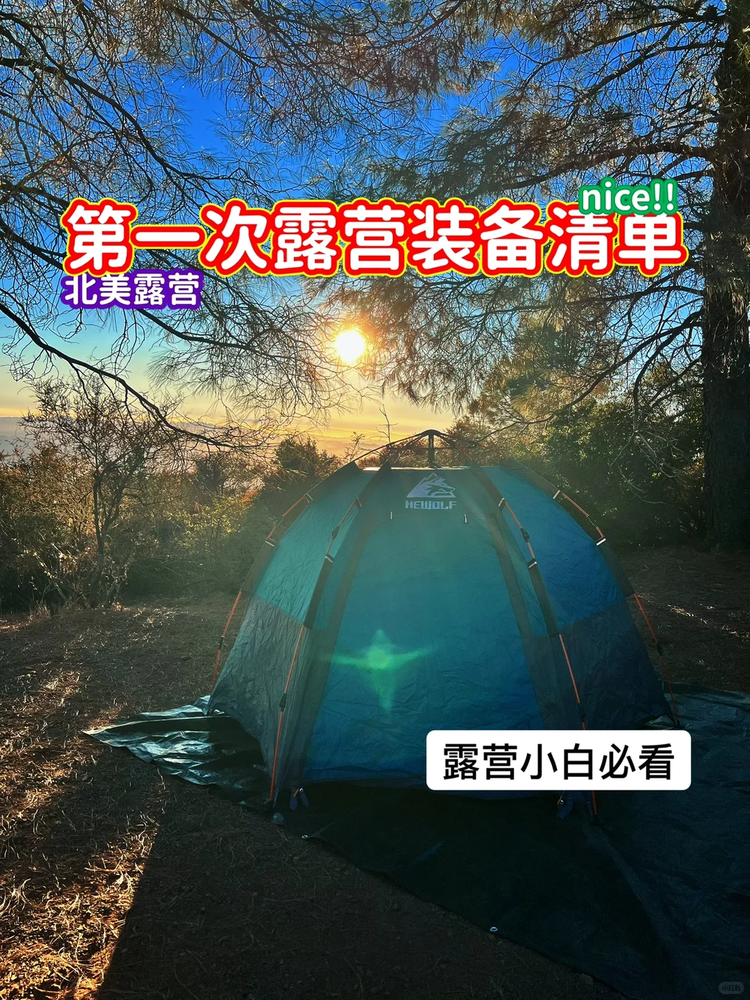
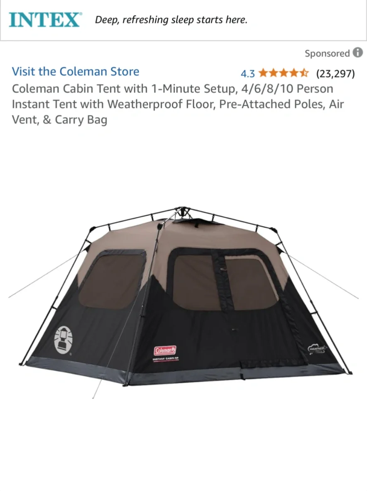
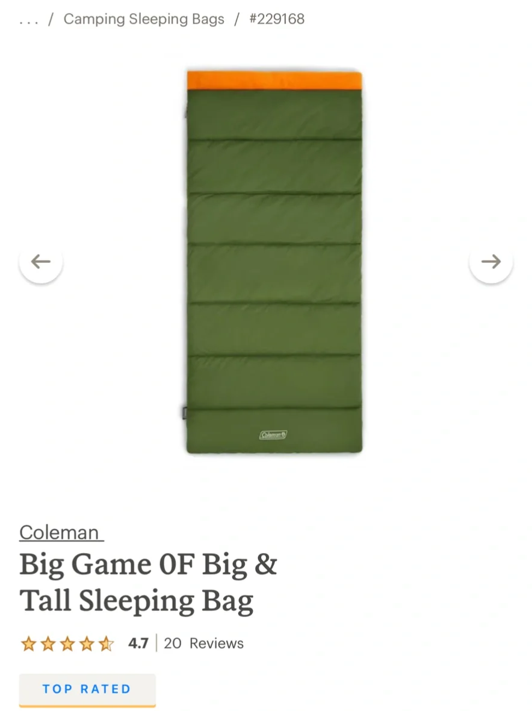
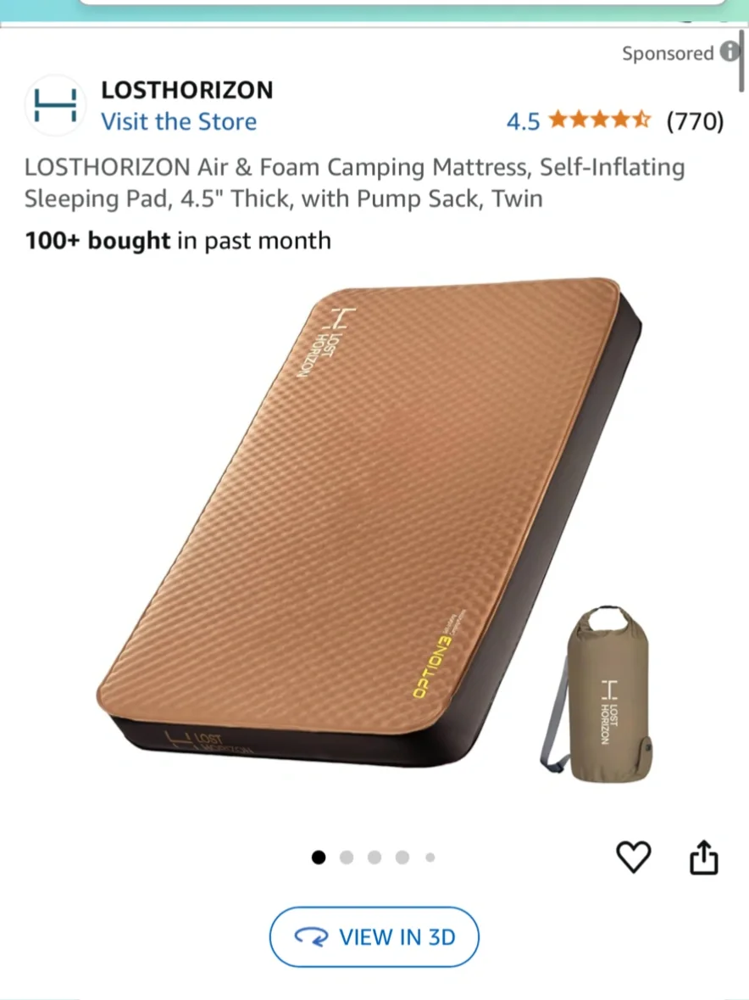
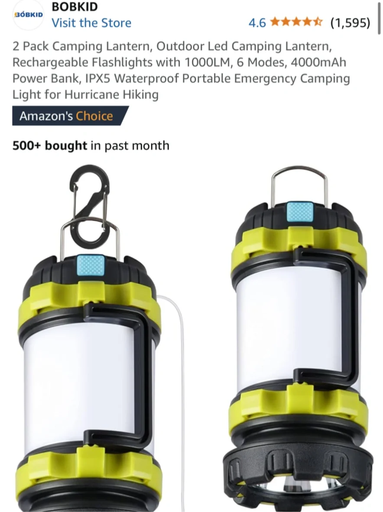

# 初次露营者必备装备：新手指南

> 抓取说明：正文与资源路径对应关系见同目录 `detail.json` 中的 `local_assets`。

## 元数据

- **笔记 ID**: `67817cc9000000000800f40b`
- **作者**: 默Moira
- **类型**: normal
- **原文链接**: http://xhslink.com/o/6v9PCU1Ohqw / https://www.xiaohongshu.com/discovery/item/67817cc9000000000800f40b?app_platform=ios&app_version=9.24&share_from_user_hidden=true&xsec_source=app_share&type=normal&xsec_token=CBGfQshZqs9gbh1Q0EVEiC7WFCU26l7CuWlM-_uzd-fAo=&author_share=1&xhsshare=CopyLink&shareRedId=N0dINzZISTo6TEZFSkozS0pJTzw1ODlM&apptime=1775630909&share_id=1c6eb551836c4bd1bfcd0c8a4ec0018d

## 正文

4/5月份开始加州附近的露营地就要开始热闹起来了，很多露营地都需要提前几个月甚至半年预定。感兴趣的小伙伴可以开始计划起来了！
	
第一次露营之旅可能是一次令人兴奋的冒险，很多小伙伴都分享过很多露营好物。不过大多分享的露营装备清单都很长。这里想分享一下，露营小白如果还不确定是否喜欢露营，第一次尝试在北美露营，最最必备的Top[一R][零R]装备：
	
睡觉装备 – 只要睡得好，露营就成功了一半
[一R] 帐篷：购买适合露营人数和气候的帐篷。初次露营者建议从一键弹出式帐篷开始。推荐Coleman Instant Tent。根据人数选择双倍容量（2 人露营时使用 4 人帐篷）。亚马逊30天可退货。记得购买放在帐篷下面的防水布。
	
[二R] 睡袋：按露营地的温度选择睡袋。注意袋子上的温度等级。信封睡袋比较舒服，热的时候打开就是个被子。
	
[三R] 睡垫：能不能睡好觉的重中之重。即使是初次露营者，也建议买个支撑度好的睡垫。Exped这个牌子的睡垫不差钱的强推。Amazon也有几款不错的平替，比如Losthorizon。充气放气很方便的同时，支撑度跟家里的床垫都差不多。不建议买便宜、薄的露营充气床垫。
	
安全装备：
[四R] 急救箱：包括绷带、消毒湿巾、镊子和止痛药等必需品。
[五R] 头灯和露营灯：带上可充电的露营灯、头灯或者手电筒。越多越好。
[六R] 便携式充电器或移动电源
	
其他露营装备
[七R] 露营椅和桌子：用于舒适地放松和进食。沃尔玛的便宜好用。
[八R] 杀虫剂和防晒霜：防止叮咬和紫外线。
[九R] 垃圾袋：打包所有垃圾，不留痕迹。
[一R][零R] 多功能工具箱：刀具用于切割、修理和打开物品，锤子用来打帐篷的地钉。
	
以上[一R][零R]项装备是每个初次露营者的必需品。不管你是集体露营还是自己露营，只要夜晚睡觉安排好了，别的都好说。除了睡觉相关的装备和灯，露营桌椅外，其他尽量用家里有的装备，以免发现自己不喜欢露营然后装备闲置。
	
至于吃，如果是集体露营，可以主动求带，大神们会把炊具准备好，你只需要动手或者购买食材。如果是自己露营，建议第一次打包外卖。自己做饭就等第二次再挑战吧！
	
[爆炸R] 个人衣服尽量多穿几层，随时根据气温增减。拖鞋也不要忘记了！
	
[爆炸R] 出发前记得提前测试装备，帐篷睡垫灯这些。尽量轻装上阵，超载会使旅行更加紧张。祝大家露营愉快！
	
#北美露营[话题]# #露营装备[话题]# #新手露营[话题]#

## 图片（本地）

## 评论（最多 20 条）

1. **啊豆豆豆zZ**（赞 0）: 请问帐篷跟床垫之间，需要防潮垫吗
   - 1. 默Moira: 帐篷下面放防潮垫

2. **Athena**（赞 1）: 移动电源你买的哪种？ link？ 谢谢
   - 1. 默Moira: 我买的ecoflow delta pro，适合长期camping的。如果新手的话，可以看看别的入门款

3. **Bobo**（赞 0）: @Steven
