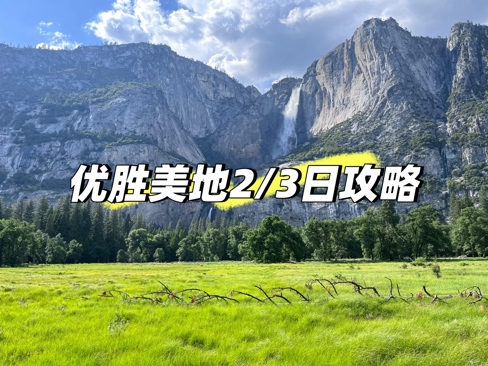
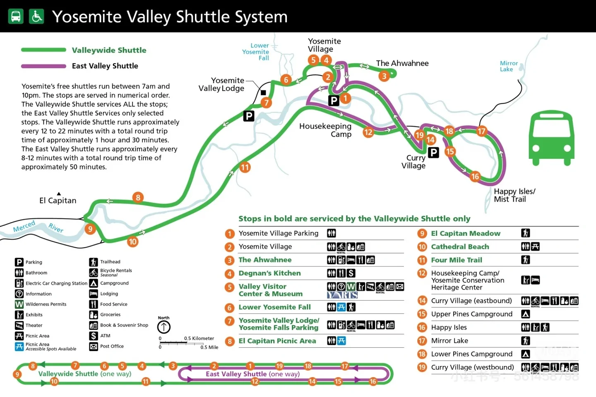
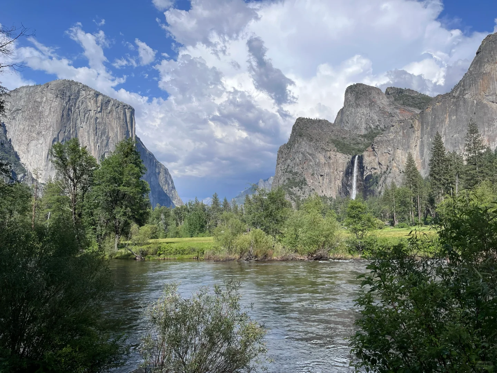
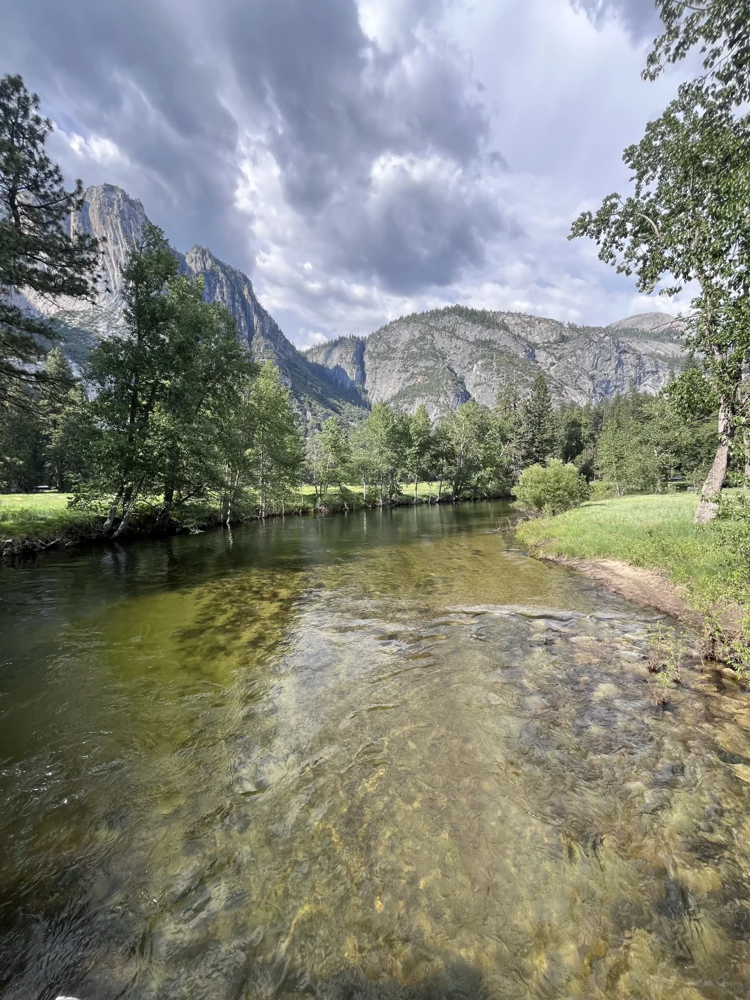
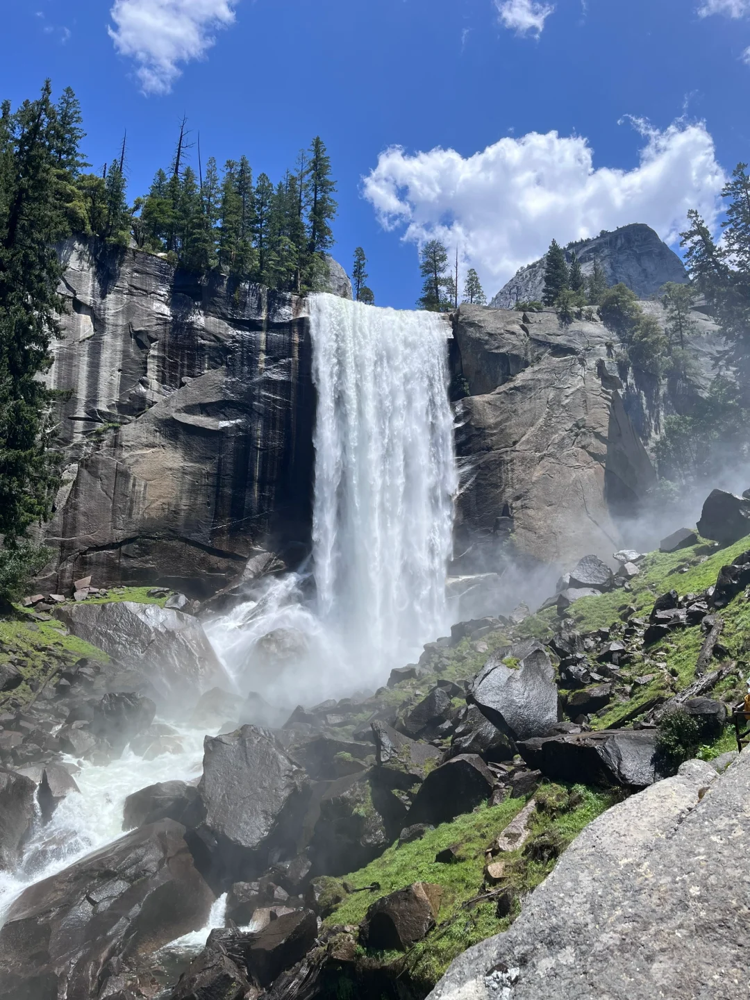
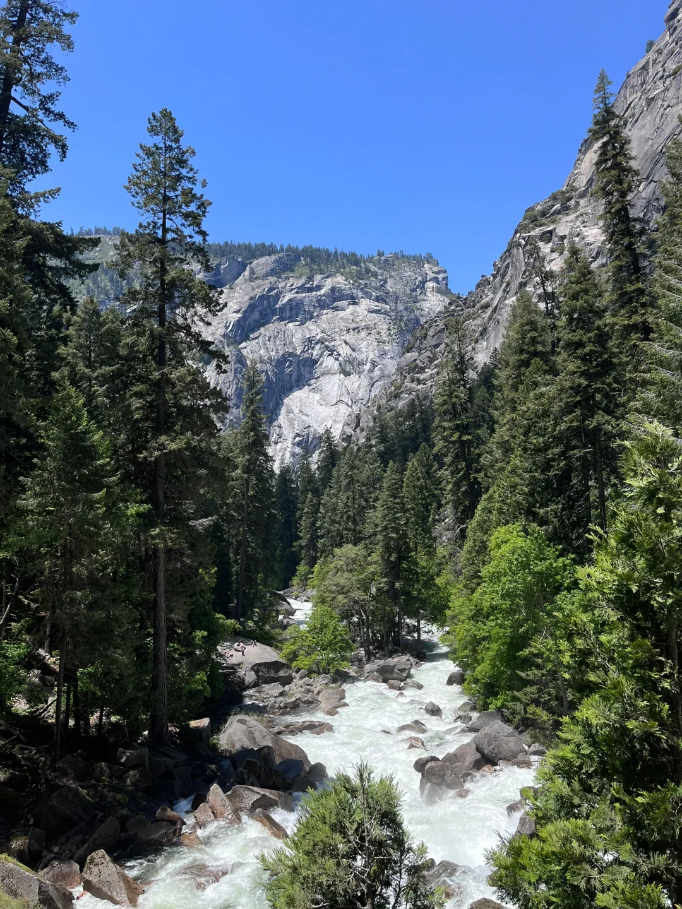
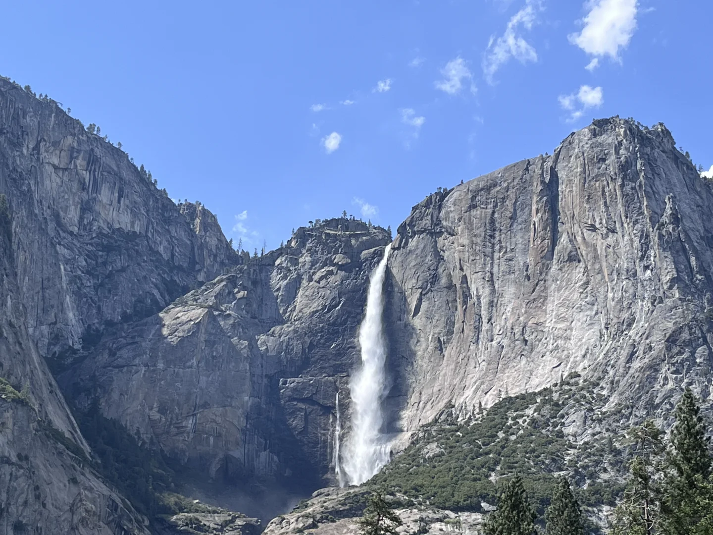
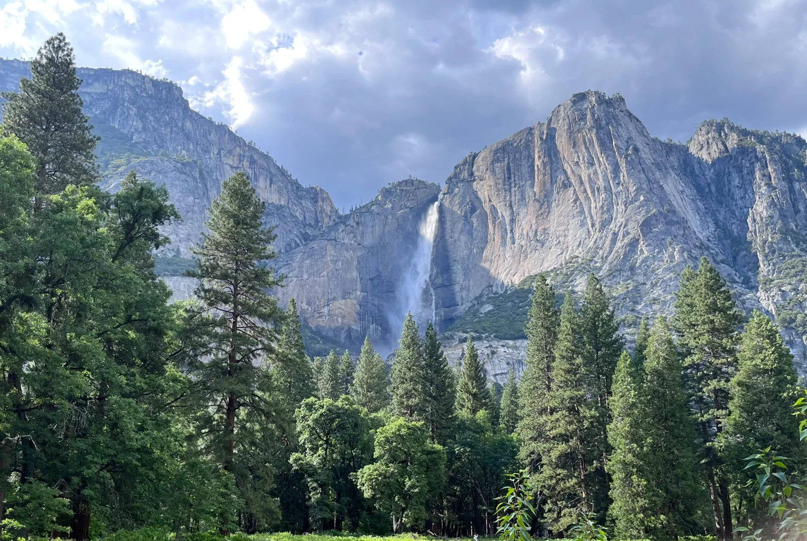
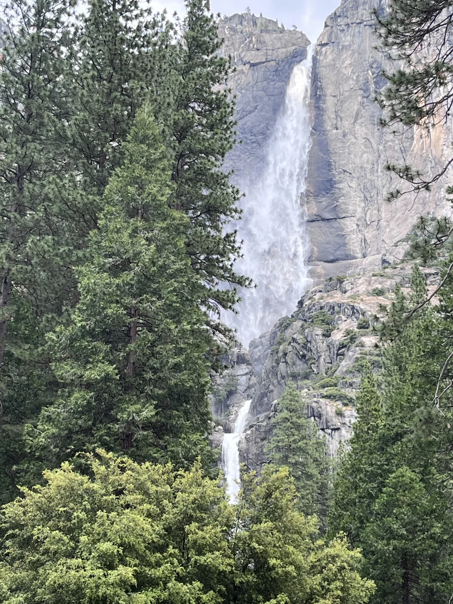
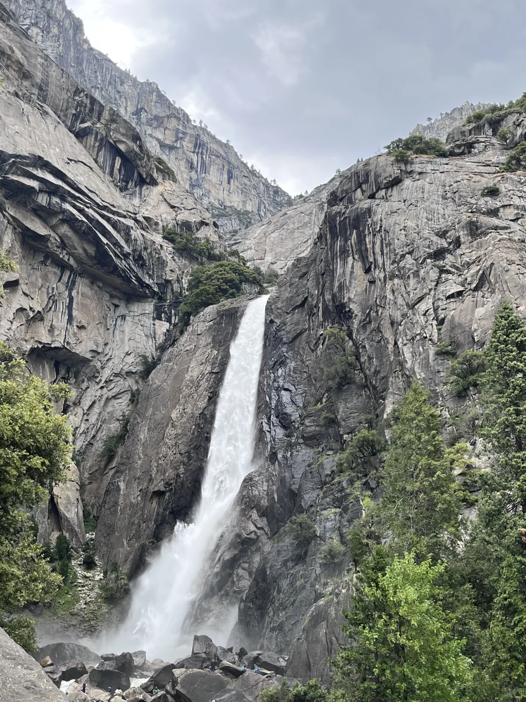

# 优胜美地最简攻略

> 抓取说明：正文与资源路径对应关系见同目录 `detail.json` 中的 `local_assets`。

## 元数据

- **笔记 ID**: `684f665f000000002002b578`
- **作者**: JR
- **类型**: normal
- **原文链接**: http://xhslink.com/o/6jxDDDxXiAh / https://www.xiaohongshu.com/discovery/item/684f665f000000002002b578?app_platform=ios&app_version=9.24&share_from_user_hidden=true&xsec_source=app_share&type=normal&xsec_token=CBUpA7oxYXxZRcuYPw6x9v5fiVbwcrv80F0riLmDwrNkA=&author_share=1&xhsshare=CopyLink&shareRedId=N0dINzZISTo6TEZFSkozS0pJTzw1ODlM&apptime=1775638500&share_id=b21e61a2ae20463b99d328529d3317ec

## 正文

行程两到三天，供特种兵和休闲游选择
	
[种草R]Day1 上午湾区出发，1-2pm到达(取决于是否园内午饭). 长途之后，适当休息放松
[飞盘R]开车熟悉园内Shuttle 路线(图2)
[飞盘R]19站Curry Village吃Pizza(1h）
[飞盘R]4站Vistor Center和博物馆逛逛，还可以看电影和美术馆（共1-2h）
[飞盘R]3站逛逛酒店Ahwahnee（公交进入-可选）
	
[种草R]Day1 4pm
[飞盘R]开车去Taft Point(1h到达+1h徒步往返）
[飞盘R] Glacier Point 看日落（尽量在天黑前7pm下山）
	
[种草R]Day1 晚饭&住宿
A.如果住南边Oakhurst(单程距Valley 1.5h山路车程，不要夜行).晚餐Smokehouse41 美式烤肉(9点关)
B.Tunnel View(不住南边就看完夕阳，回园内吃饭，然后看星空，休息好准备明天徒步)
	
[种草R]Day2 上午徒步游（体力有限可略过）
[飞盘R]早上如果九十点后才到Valley，进三大停车场比较困难。只要路边有车，可以跟着停。
[飞盘R]Shuttle避坑，人多排队，换班时候等1-2h. 紫线站点间比较近，绿线很远，尽量把车停到紫线站，最差停到绿线6/7号站。
[飞盘R]Mist Trail第一段到Vernal Falls Footbridge坡度很大，第二段到Vernal Falls石阶湿滑，第三段景色普通.
[飞盘R]个人只到Vernal Falls石阶，没有登顶，往返2-3小时。如果不是徒步爱好者，没有必要硬磕。
	
[种草R]Day2 2pm Valley精华游览
[飞盘R]Bridalveil Fall Viewpoint（徒步30-45分钟往返）
[飞盘R]Cook‘s Meadow Loop（在7站停车，徒步走两桥，看大草坪和Yosemite Fall, 30-45分钟往返）
[飞盘R]Lower Yosemite Falls（步道平坦30-45分钟往返）
[飞盘R]Valley View, El Capitan Meadow（车可停路边，河边景色，适合轻松拍照）
	
[种草R]Day2 5pm回酒店吃晚饭休息或者回程
	
[种草R]Day3 (不想徒步辛苦的，可替代Day2)
[飞盘R]上午逛逛Valley其他景点
[飞盘R]或者去Mariposa Grove看巨杉
	
[种草R]往返
120和140均可，没有南边山路难开，只要白天在限速内并不危险，后面有车让就行。
#湾区[话题]# #优胜美地[话题]#

## 图片（本地）

## 评论（最多 20 条）

1. **汤圆和大脑**（赞 0）: 请问周末1-2点到，有园内住宿订单，大概排队多长时间可以进呀？
   - 1. JR: 现在还要查预约，不好说

2. **Tn**（赞 0）: 最近瀑布水量是不是少很多了，听说夏天是枯水期
   - 1. JR: 最近不知道，我六月初去的，感觉水量巨大如图

3. **zzzx**（赞 1）: 请问下住宿有推荐吗
   - 1. JR: 园内->西门->南门.
