# Yosemite 第一次游玩超轻松路线

> 抓取说明：正文与资源路径对应关系见同目录 `detail.json` 中的 `local_assets`。

## 元数据

- **笔记 ID**: `699d3bd5000000000a030272`
- **作者**: MammaMia
- **类型**: normal
- **原文链接**: http://xhslink.com/o/3798605DnYG / https://www.xiaohongshu.com/discovery/item/699d3bd5000000000a030272?app_platform=ios&app_version=9.24&share_from_user_hidden=true&xsec_source=app_share&type=normal&xsec_token=CB9zwIfe3bVDNUmQzskxiYaJFrLUWpXfOp95gNle5MLnY=&author_share=1&xhsshare=CopyLink&shareRedId=N0dINzZISTo6TEZFSkozS0pJTzw1ODlM&apptime=1775631057&share_id=f97fb308ee864ec5a986f9ab041922af

## 正文

这是我们第一次去Yosemite玩 两天一夜
1️⃣大致行程：
Day1 上午湾区出发 路程大约4小时 到达时间下午3点 排队入园时间下午4点（之所以排队较长应该跟火瀑布有关，第二天我们12点到的基本就没排队，周天看火瀑布的人也少了些）然后去看了#火瀑布[话题]# 晚上住在 Oakhurst（开出去一个多小时）
Day2 这一天闲逛了Yosemite Valley 大概12点入园逛到下午6点 中途还在welcome center 吃东西买东西休整了一下 一个下午感觉浅逛一下是够的（建议能早起还是早起 时间更充裕）
2️⃣Yosemite当然不止Yosemite Valley。但这应该是第一次去的人常选择的路线。另外由于时间不足+暴雪导致的一些景点的关闭，综合下来我们这次只逛了这块区域。
我们这次临时决定去是看到了火瀑布相关的信息 所以第一天去的时候做的攻略不足 感觉网上的信息也有点繁杂 因此第一天晚上我们在bilibili找了一个比较详细的视频介绍（非常建议去之前看一下了解下一些必要的景点信息和背后的故事 逛的时候也会更有意思）最后是按照图2的打卡点大致游览的（Valley里面是单行线 就按照图片地点从Tunnel View开始导航一个一个逛过去的）图片上也有标注这些照片地点。除了El Capitan因为火瀑布的关系不好停车 其他地方我们是停车去逛了逛的 跟第一天我们开车路过的感觉完全不同 下车一边闲逛一边欣赏景色真的是非常好的体验（我们属于走路也比较慢的 当天除了Bridalveil Fall其他地方感觉人都比较少 很宁静的感觉（也可能都去看火瀑布了？））
3️⃣一些建议：
1）参考我们这次旅行 如果可以早起 从湾区出发其实一天是可以逛完我们逛的这些比较精华的景点的（当然要考虑来回开车还有很多山路的疲惫）另外我们没有也没有走一些比较长的trail啥的属于超轻松游了
2）提前了解下天气情况 看下官网 以便安排行程
3）Yosemite感觉很难一次逛完 我们也是打算以后其他季节再去逛逛的 因此这次也比较悠闲点
4）定酒店的时候不要光搜Yosemite 出来的可能是山下的小镇 开车还要一个多小时山路呢 不过也有看到有人说里面的住宿条件一般的 都有利弊吧
Yosemite真的很美 非常推荐～
#Yosemite冬[话题]# #Yosemite[话题]##优胜美地[话题]#

## 图片（本地）

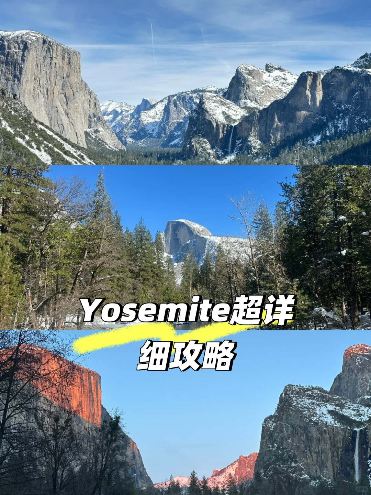

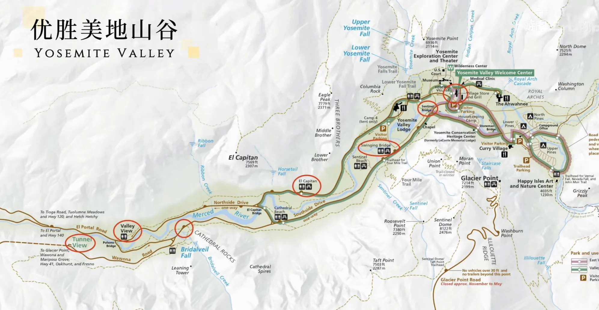

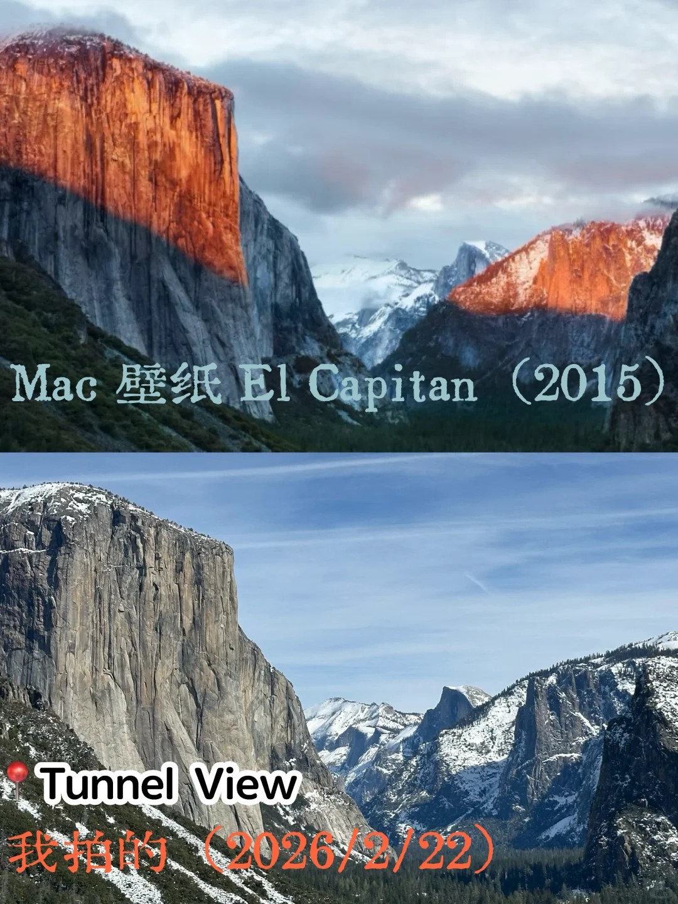

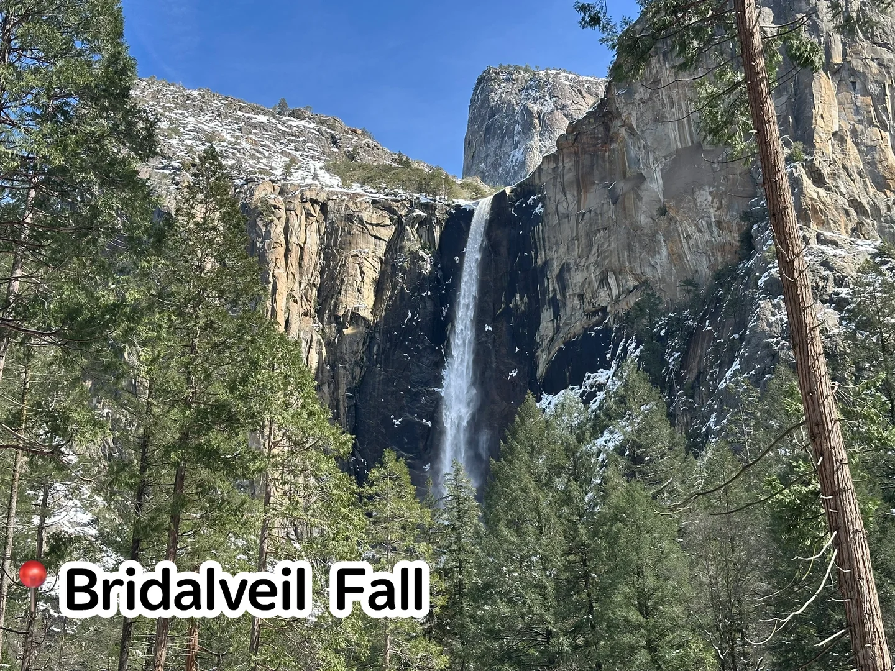

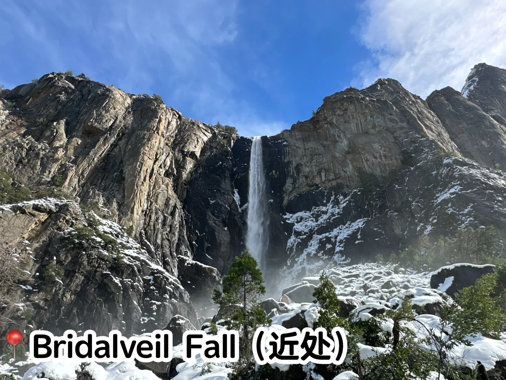

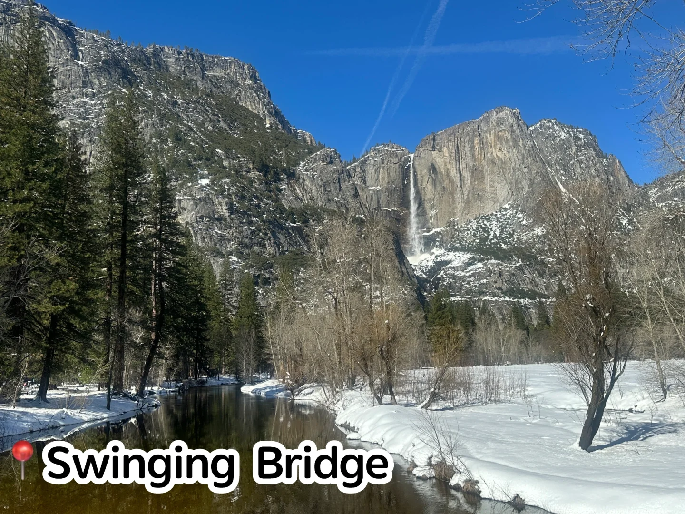

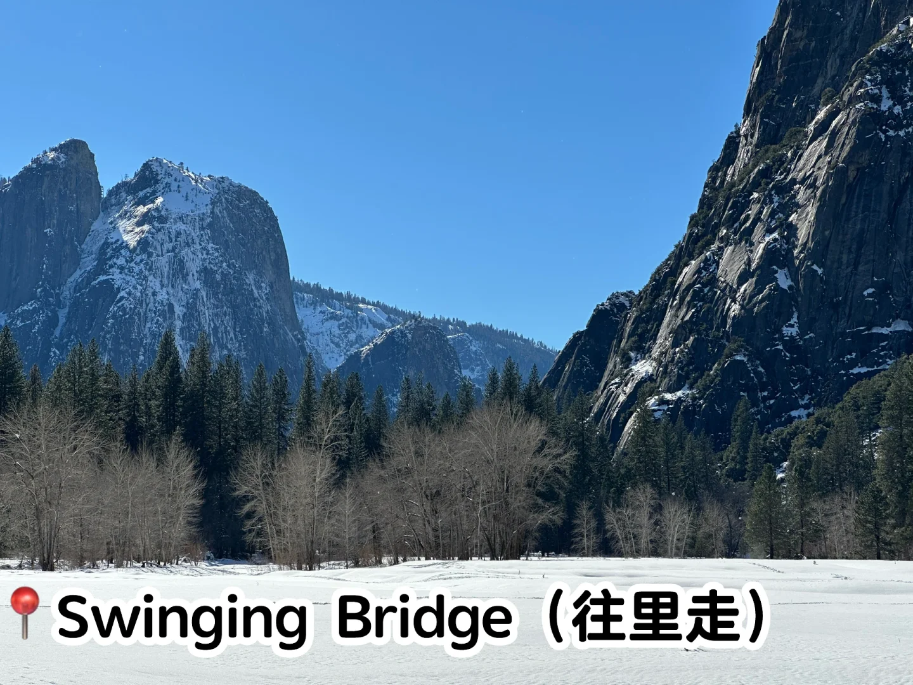

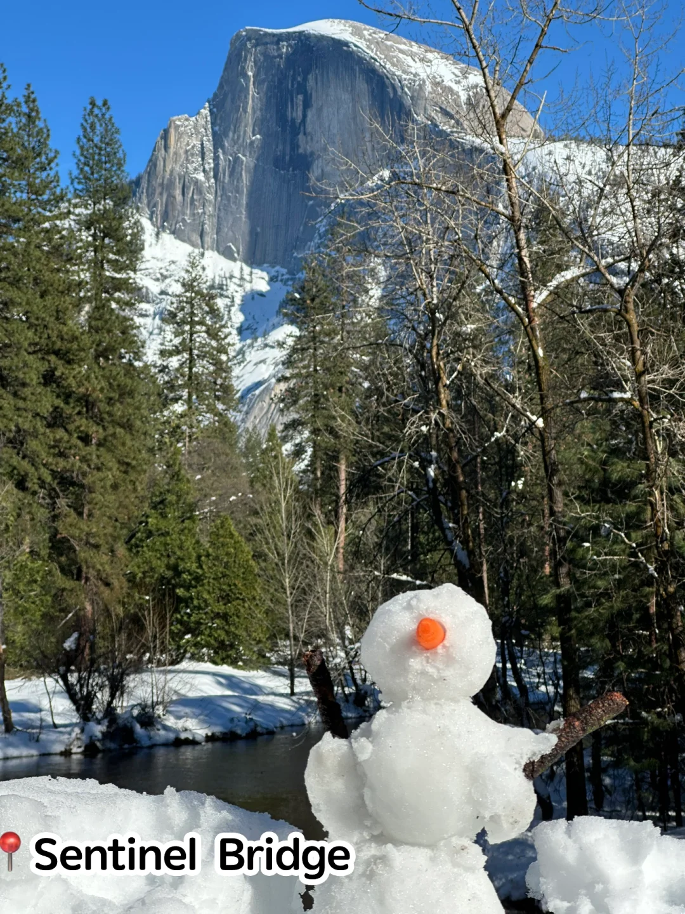

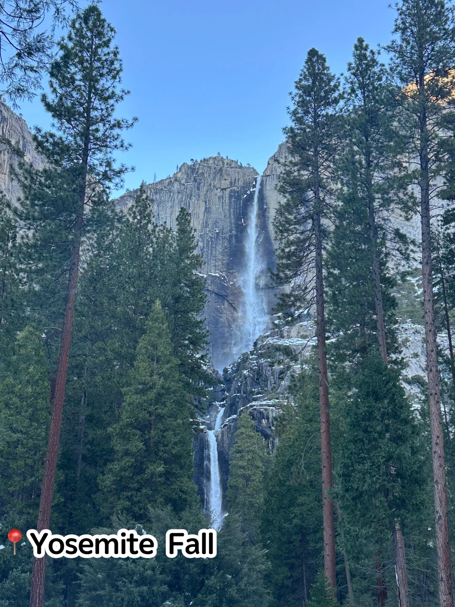

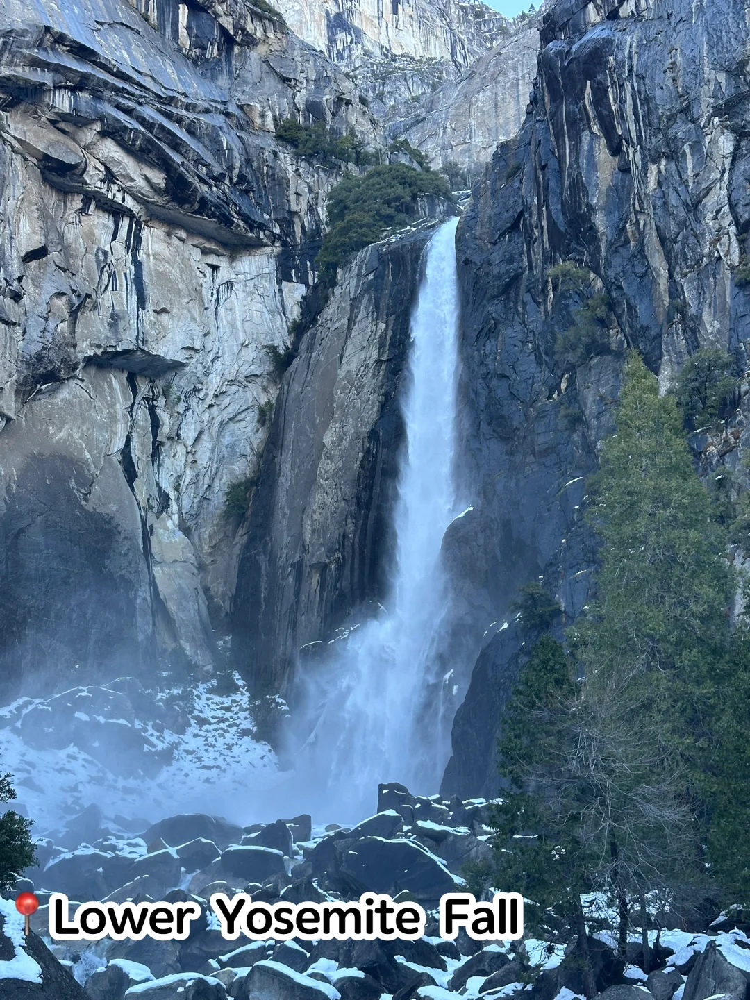

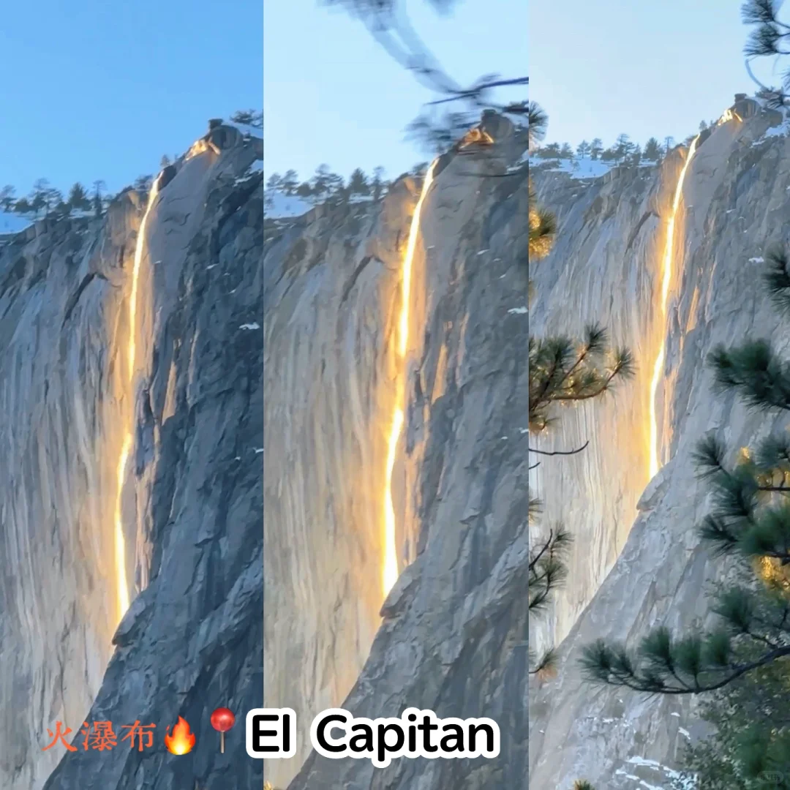

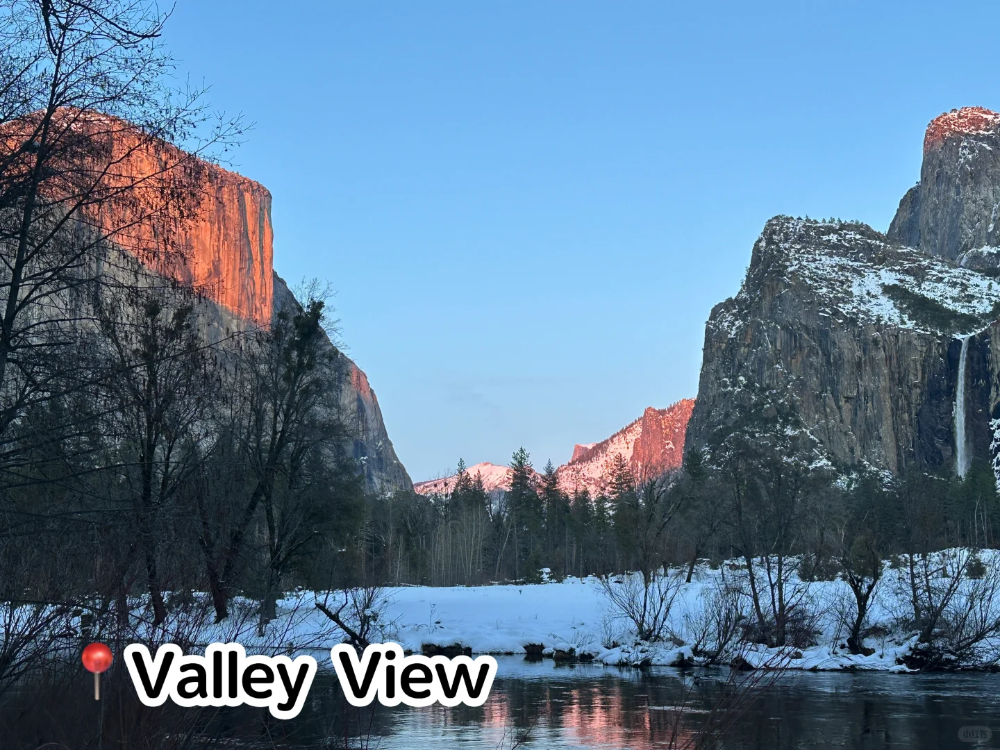

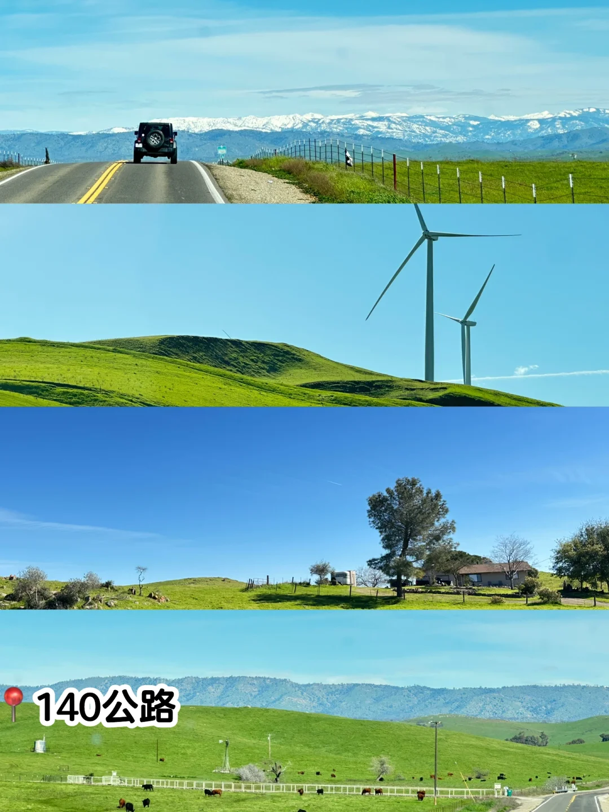

## 评论（最多 20 条）

1. **Andy**（赞 0）: Oakhurst哪家酒店民宿？推荐一下，谢谢
   - 1. Andy: 在哪里预定？

2. **Tim**（赞 0）: 3.27-29有人一起吗
   - 1. 在加州: 请问你哪里出发？

3. **洞幺洞幺我是洞拐**（赞 1）: 蹲一个b站视频~
   - 1. MammaMia: 搜Yosemite Valley

4. **小红薯69CDBC2A**（赞 1）: 4.8-10 oakhurst不知道蹲不蹲得到摊油费的

5. **Aphrodite's Child**（赞 0）: 请问是哪天去的呀？需不需要雪链呢
   - 1. MammaMia: 上个周末 2.21-2.22 我们带了雪链 第一天入园没有问雪链 第二天入园问了是否有携带雪链 去之前可以看下官网 会写需不需要带雪链 没有雪链的话其实可以像我们一样autozone买一下 如果没有被使用是可以退的

6. **爱玩的Mickey_：)**（赞 0）: 好详细的攻略，感谢分享🌹已收藏留用求别删
   - 1. MammaMia: 谢谢呀～

7. **endc**（赞 0）: 明天有一起去的吗，半岛出发

8. **isabellaxuanyi**（赞 0）: 需要提前预约入园吗
   - 1. MammaMia: 我们直接去的 搜了下应该是2026取消预约了 不放心的话可以去之前再搜下

9. **chow**（赞 1）: 请问从哪个门进入的呢？我看好多路都封了。谢谢！
   - 1. MammaMia: arch rock entrance

10. **小红薯68B62C41**（赞 0）: 可以推荐下b站视频介绍吗？明天打算去～
