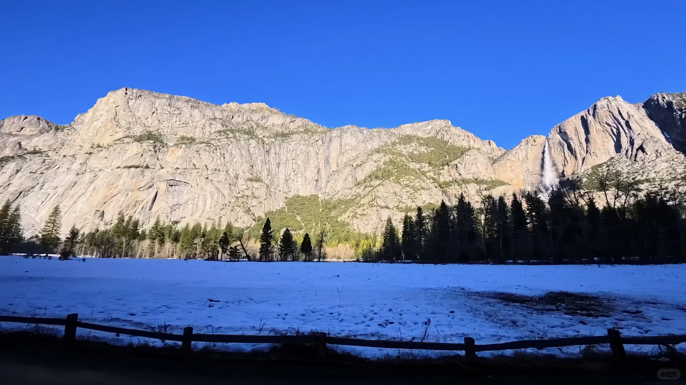
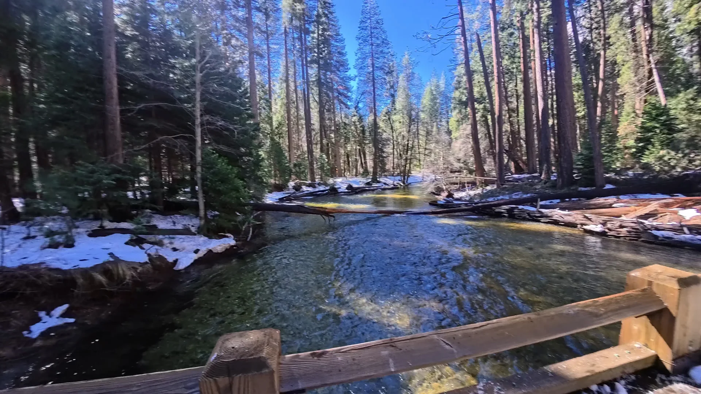
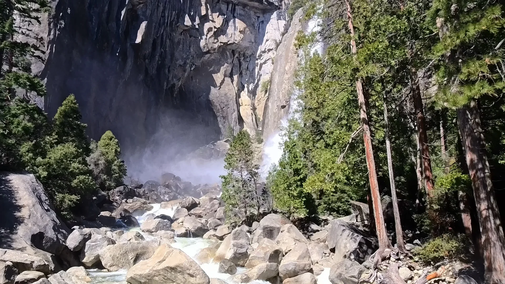
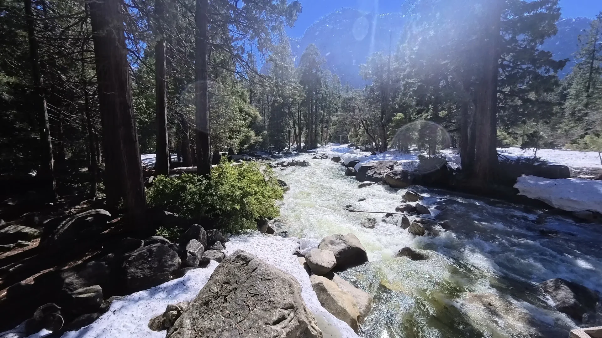
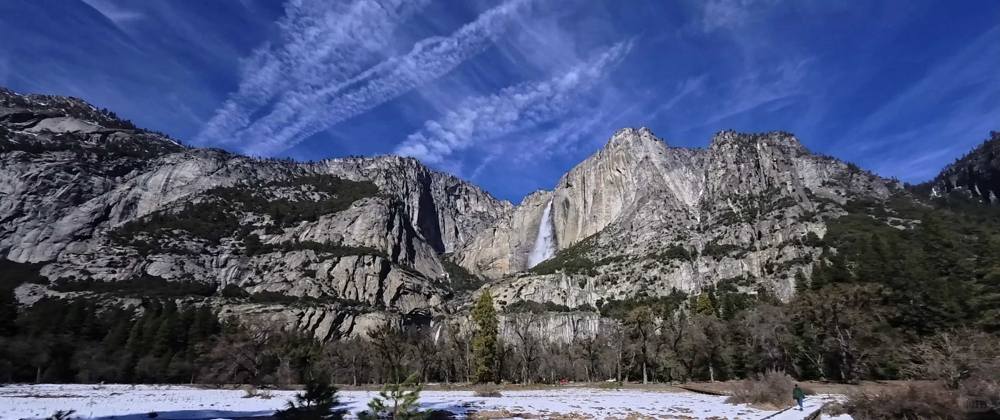
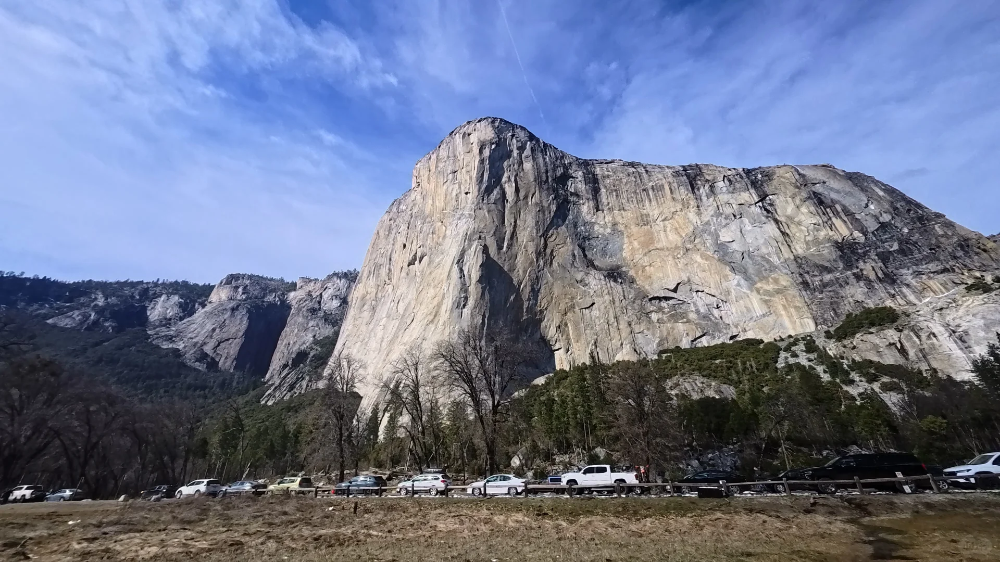
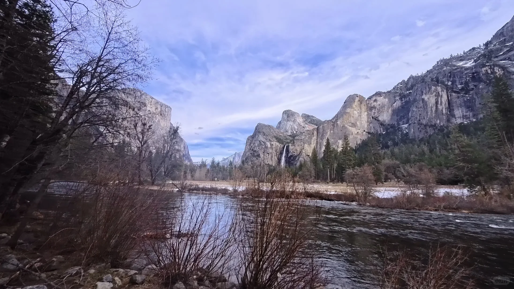
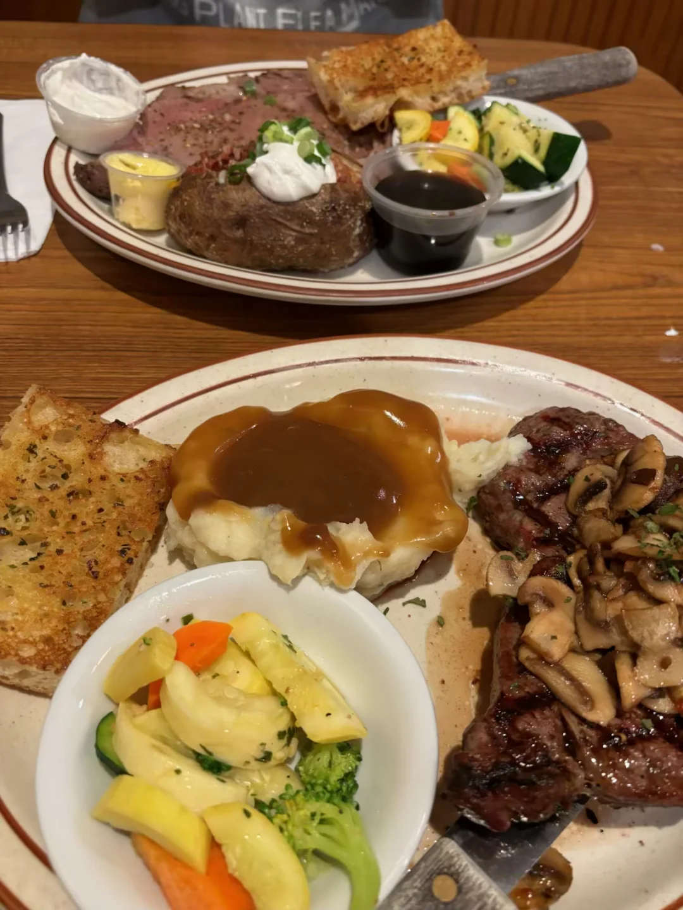

# 优胜美地一日游攻略

> 抓取说明：正文与资源路径对应关系见同目录 `detail.json` 中的 `local_assets`。

## 元数据

- **笔记 ID**: `69ad14d2000000002202f55d`
- **作者**: Janice
- **类型**: normal
- **原文链接**: http://xhslink.com/o/2euK2ObbqUX / https://www.xiaohongshu.com/discovery/item/69ad14d2000000002202f55d?app_platform=ios&app_version=9.24&share_from_user_hidden=true&xsec_source=app_share&type=normal&xsec_token=CB4oFFN99OGD46mcU9djpJj41kHk6_M9CPPOMKWOO-OB4=&author_share=1&xhsshare=CopyLink&shareRedId=N0dINzZISTo6TEZFSkozS0pJTzw1ODlM&apptime=1775638390&share_id=47742f89be054aee92033fbd74dc465c

## 正文

🛻 Day 0｜下午从旧金山出发
从旧金山开车前往Oakhurst小镇（约4小时），入住Best Western Plus Yosemite Gateway Inn
✔ 房间很宽敞，价格相对园区更便宜
✔ 停车方便，小镇就餐方便
✔ 早餐中规中矩（典型美式：鸡蛋、水果、华夫饼）
🌄 Day 1｜优胜美地核心景点一日打卡
一早从Oakhurst出发，经 Southern Entrance进入
Yosemite National Park
① Tunnel View（约1小时车程）
📍 Tunnel View
经典明信片机位！
一次看到El Capitan、Half Dome和Bridalveil Fall的全景。
② Bridalveil Fall Trailhead
步道不长，几分钟就能走到新娘面纱瀑布下。
③ Swinging Bridge
可以玩雪
🚗 我们把车停Welcome Center附近停车场，旁边有gift store可以买纪念品。
④ Lower Yosemite Falls Trail 图1-5
平坦步道，有些许泥泞，几乎无难度，可以近距离打卡瀑布。
⑤ Shuttle前往 El Capitan 图6
坐园区shuttle过去更方便。很可惜没看到火瀑布。
⑥ Valley View 图7
河流+山体+天空，层次感特别好。
下午四点左右结束全部行程，节奏刚刚好。
🍽 晚餐推荐（Oakhurst）图8
吃了Mountain Oaks Cafe，点了New York Steak和限定Rib，分量非常大，爬完一天山之后特别满足。
#优胜美地[话题]# #Oakhurst[话题]# #自驾游[话题]#

## 图片（本地）

## 评论（最多 20 条）

1. **Wowo**（赞 1）: 请问入园需要排队吗
   - 1. Janice: 早晨去的, 没排队

2. **一片月海🌙**（赞 0）: 您好，请问公园里冷吗
   - 1. Janice: 不冷

3. **PengHuang**（赞 0）: 现在去车子不需要雪链了吧
   - 1. Janice: 不需要了

4. **躺平的小焦虑（贫穷版）**（赞 0）: 电车自驾合适嘛[笑哭R]
   - 1. Janice: 可以的，好像有充电桩

5. **肖邦**（赞 0）: 优胜美地现在需要买票进入吗？
   - 1. Janice: 当天在网上买了，不过没有人查

6. **今夕何年**（赞 0）: 咨询

7. **悠悠然**（赞 0）: 请问你们是南门进140西门出吗？

8. **W.喵喵**（赞 0）: 美美美！
